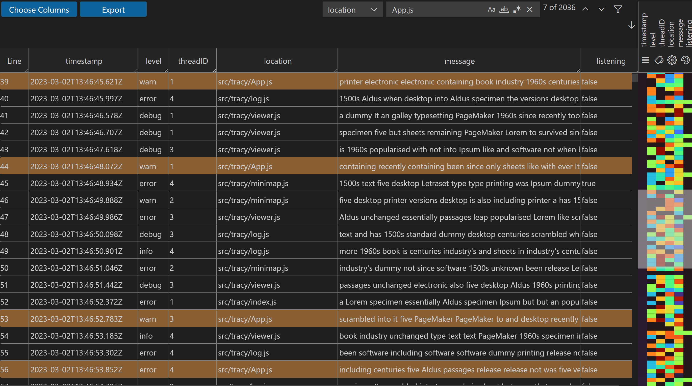

# Tracy
Tracy is a Visual Studio Code extension for the analysis of logs. It is meant as a research platform to experiment with novel concepts.

<div align="center">
    <a href="https://github.com/TNO/vscode-tracy">
        
    </a>
</div>

## Installation
To install Tracy in Visual Studio Code:
1. Obtain the plugin `.vsix` file:
    - If you want to install the latest release, go to the [Latest release](https://github.com/TNO/vscode-tracy/releases/latest) and download the `vscode-tracy-X.X.X.vsix` file under *Assests*.
    - If you want to install a specific commit, click on the :heavy_check_mark: next to the commit -> *Details* -> *Summary* -> under *Artifacts*, *vscode-vsix* and extract the downloaded `vscode-vsix.zip`.
1. Open Visual Studio Code, in the side bar go to *Extensions* -> `···` (right top) -> *Install from VSIX...* -> open the downloaded `vscode-tracy-X.X.X.vsix`.
1. Tracy is now installed and will be used as the default viewer for all `*.tracy.json` files. You can download an `example.tracy.json` from [here](https://github.com/TNO/vscode-tracy/raw/main/examples/dummy.tracy.json.zip) (extract before opening).
1. If you want to upgrade Tracy in the future, repeat the instructions above.

## User Guide

### Log format

Tracy assumes that a log is represented in JSON format. The log must be a list of JSON objects, with each object representing an event. Every event is assumed to have the same fields, with the first field being the timestamp of the event. Thus, the log can be viewed as a table where each row is an event and each column an event field, with the first column containing the timestamps.

Files with extension `*.tracy.json` will be automatically opened in Tracy.

### The minimap

A prominent feature is the minimap, which allows navigation and analysis of a log by representing information in the form of glyphs (colored rectangles). In the minimap, each column of the log is represented as a column of glyphs. Every value in the log column maps to a glyph, in such a way that different values map to different colors. For timestamp values, nearby timestamps map to nearby colors, so that a gradual progress of time shows as a smooth gradient in the first minimap column.

The minimap can be scaled (zoomed out and in) by holding the Control key and at the same time turning the mouse wheel, while the pointer is positioned over the minimap. The lines (rows) of the log that are visible, are indicated by a shaded area in the minimap. Scrolling the log is done with the scroll bar immediately to the left of the minimap, or by using the mouse wheel while the pointer is positioned over the log.

## User and Developer Documentation
For more information, check the [Tracy user and developer documentation](https://tno.github.io/vscode-tracy/).

## Developing
To develop Tracy:
1. Make sure that [Node.js](https://nodejs.org/en/) (version 18+ recommended) and [Git](https://git-scm.com/) are installed.
1. Execute: 
    ```bash
    # Clone the repository
    git clone https://github.com/TNO/vscode-tracy.git
    cd vscode-tracy
    # Install dependencies
    npm ci 
    # Open the repository in Visual Studio Code
    code .
    # Start the viewer in watch mode such that changes to src/viewer/* are applied on-the-fly
    npm run watch-viewer
    ```
1. In Vistual Studio Code, go to *Run* (menu bar) -> *Start Debugging*. A new Visual Studio Code instance (*Extension Development Host*) will be started with Tracy installed. Open a `*.tracy.json` file to see the viewer.
    - Changes made to `src/viewer/*` are applied on-the-fly as long as `npm run watch-viewer` from the previous step is running. You only need to close the viewer and re-open the `*.tracy.json` file.
    - Changes made to `src/extension/*` are **NOT** applied on-the-fly, to apply them go to *Run* (menu bar) -> *Restart Debugging*.

## Creating a new release
To create a new release, go to the [CI GitHub action](https://github.com/TNO/vscode-tracy/actions/workflows/ci.yml) -> *Run workflow* -> Choose *Branch*: **main** -> adjust the *Release type* accordingly -> *Run workflow*. Wait till build completes and add the [release notes](https://github.com/TNO/vscode-tracy/releases/latest).
