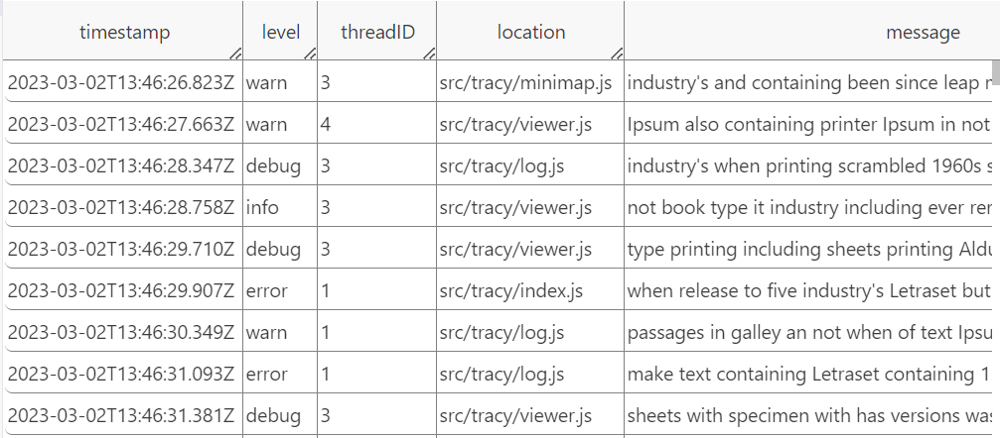

# Component name
(Screenshot of component - Optional)

---
This component contains the table that shows the content of the log. Each row shows one log record and each column shows the value of the corresponding column.

## Relations to other components

- **Parent:** App

## Props

| Name | Type | Description |
| ---- | ---- | ----------- |
| `LogFile` | `LogFile` | it contains the content of the input log/logs |
| `onLogViewStateChanged` | `function` | A function to update logview state to the parent component |
| `onSelectedRowsChanged` | `function` | A function to pass the selected row to the parent component when it is changed |
| `onRowPropsChanged` | `function` | A function to pass the property of the row when it is changed |
| `forwardRef` | `React.RefObject<HTMLDivElement>` | A ref object for update the scrolling between log view and minimap |
| `coloredTable` | `boolean` | boolean for switching the colored table On/Off |
| `rowProperties` | `RowProperty[]` | A interface to keep all the row related properties |
| `currentStructureMatch` | `number[]` | The current selected structure |
| `structureMatches` | `number[][]` | All the matched structures |
| `structureMatchesLogRows` | `number[]` | The row number of all the matched structures |
| `collapsibleRows` | `{ [key: number]: Segment }` | A map for the segment annotation, the key is the number of row where the segment starts, the value is the interface Segment contains the start row, end row and the nested level |
| `clearSegmentation` | `function` | A function to delete all the segmentations |

## State

| Name | Type | Initial Value | Description |
| ---- | ---- | ------------- | ----------- |
| `state` | `LogViewState` | `undefined` | A state to keep several values for representing the log view |
| `columnWidth` | `{ [id: string]: number }` | `LOG_COLUMN_WIDTH_LOOKUP` | A map to keep the width of each column  |
| `logFile` | `LogFile` | `this.props.logFile` | it contains the content of the input log/logs  |
| `collapsed` | `{ [key: number]: boolean }` | `[]` | A map to keep tracking if the segmentation is collapsed |

## Functions
### Component lifecycle functions
- ### `constructor(...)`
	- **Params:** 
	    - `props: Props`
	- **Description:**  bind the RefObject and the log view state; initialize the states;
	- **Returns:** -

- ### `componentDidMount(...)`
	- **Description:** add event listener for window resize.

- ### `componentDidUpdate(...)`
	- **Params:**
        - `nextProps: Readonly<Props>`
        - `nextState: Readonly<State>`
        - `nextContext: any`
	- **Description:** check whether the log file or currentStructureMatch is changed. If so, call the updateState() function.
	- **Returns:** -

- ### `renderColumn(...)`
	- **Params:**
        - `value: string`
        - `columnIndex: number`
        - `isHeader: boolean`
		- `width: number`
		- `colorMap: string`
	- **Description:** This function returns the Div for a single column.
	- **Returns:** Div of type `JSX.Element`

- ### `renderRows()`
	- **Description:** return the Div for all the visible rows and its segmentations.
	- **Returns:** Div of type `JSX.Element` 

- ### `renderSegmentForRow(...)`
	- **Params:**
        - `r: number`
        - `level: number`
	- **Description:** This function returns the Div for the segmentation of a single row.
	- **Returns:** Div of type `JSX.Element`

- ### `renderHeader(...)`
	- **Params:**
        - `width: number`
	- **Description:** This function returns the Div for the header.
	- **Returns:** Div of type `JSX.Element`

- ### `renderHeaderColumn(...)`
	- **Params:**
        - `value: string`
		- `columnIndex: number`
		- `isHeader: boolean`
		- `width: number`
	- **Description:** This function returns the Div for each column in the header.
	- **Returns:** Div of type `JSX.Element`

- ### `render()`
	- **Description:** This function renders the log view.
	- **Returns:** Div of type `JSX.Element`
	
### Functionality-related functions

- ### `collapseRows(...)`
	- **Params:**
        - `index: number`
	- **Description:** This function updates the state `collapsed`
	- **Returns:** A new map for `collapsed`

- ### `updateState(...)`
	- **Params:**
        - `currentStructureMatchFirstRow: StructureMatchId`
	- **Description:** This function updates the log view state
	- **Returns:** -

- ### `setColumnWidth(...)`
	- **Params:**
        - `name: string`
		- `width: number`
	- **Description:** This function updates the column width.
	- **Returns:** -

- ### `columnWidth(...)`
	- **Params:**
        - `name: string`
	- **Description:** This function returns default width for column.
	- **Returns:** -

- ### `isLight(...)`
	- **Params:**
        - `color: string`
	- **Description:** This function returns if the given color is light/dark.
	- **Returns:** `boolean`

- ### `getRGB(...)`
	- **Params:**
        - `level: number`
	- **Description:** This function returns the corresponding color for the given level of Segmentation.
	- **Returns:** RGB color

- ### `getVisibleRows()`
	- **Description:** This function returns the number of visiable rows.
	- **Returns:** `number`

- ### `deleteSegmentAnnotations()`
	- **Description:** This function clears all the segmentations.
	- **Returns:** -
