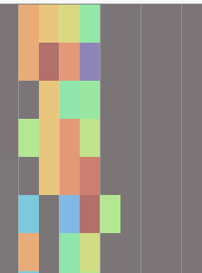

# Minimap View
(Screenshot of component - Optional)

---
This component contains the colored map which visualizes the log contents according to the value in every cell.

## Relations to other components

- **Parent:** App

## Props

| Name | Type | Description |
| ---- | ---- | ----------- |
| `logFile` | `LogFile` | it contains the content of the input log/logs |
| `logViewState` | `LogViewState` | A state to keep several values for representing the log view |
| `onLogViewStateChanged` | `function` | A function that update the log view state to other components |
| `forwardRef` | `React.RefObject<HTMLDivElement>` | A ref object for update the scrolling between log view and minimap |
| `rowProperties` | `RowProperty[]` | A interface to keep all the row related properties |

## State

| Name | Type | Initial Value | Description |
| ---- | ---- | ------------- | ----------- |
| `state` | `LogViewState` | `undefined` | A state to keep several values for representing the log view  |
| `scale` | `number` | `1` | the scale of the Mini map. If it is 1, then minimap 1: 1 matches the log view. If it is 0, minimap matches all the log view. |
| `controlDown` | `boolean` | `false` | A state represents whether the ctrl button is pressed |

## Functions
### Component lifecycle functions

- ### `constructor(...)`
	- **Params:** 
	    - `props: Props`
	- **Description:**  initializes the minimap canvas and the states; bind handlers for wheel and click actions; 
	- **Returns:** -
- ### `componentDidMount(...)`
	- **Description:** add three events listener for window resize, the ctrl key down and up. 

- ### `componentDidUpdate(...)`
	- **Params:**
        - `nextProps: Readonly<Props>`
        - `nextState: Readonly<State>`
        - `nextContext: any`
	- **Description:** check whether the logViewState, scale or the logFile is changed. If so, call the draw() function.
	- **Returns:** -

- ### `render()`
	- **Description:** renders the minimap canvas
	- **Returns:** div of type `JSX.Element`

### Functionality-related functions

- ### `draw()`
	- **Description:** draw the minimap and the grey block.
	- **Returns:** -

- ### `handleClick(...)`
	- **Params:**
        - `e: React.MouseEvent<HTMLElement>`
	- **Description:** A function to handle the click action on a random point on the canvas, the log view will jump to that point.
	- **Returns:** -

- ### `handleWheel(...)`
	- **Params:**
        - `e: React.WheelEvent<HTMLCanvasElement>`
	- **Description:** A function to handle scroll action on the canvas. Depends on whether "ctrl" is pressed, it will either scroll the minimap or Zoom In/Out.
	- **Returns:** -

- ### `updateState(...)`
	- **Params:**
        - `scale: number`
	- **Description:** A function to update the log view state when the scale is changed by zooming in/out the minimap.
	- **Returns:** -

- ### `controlDownListener(...)`
	- **Params:**
        - `e: any`
	- **Description:** A function triggered by key down event of "ctrl", it will set the state controlDown to true.
	- **Returns:** -

- ### `controlUpListener(...)`
	- **Params:**
        - `e: any`
	- **Description:** A function triggered by key up event of "ctrl", it will set the state controlDown to false.
	- **Returns:** -
