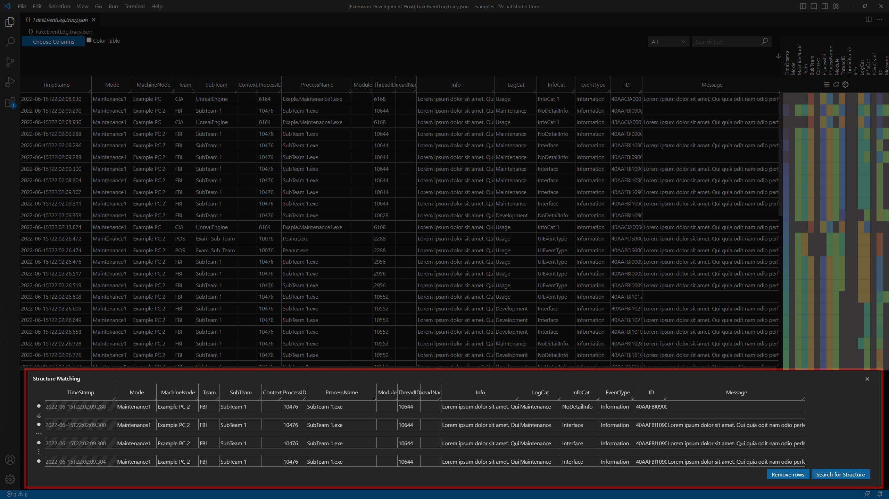

# Structure Dialog

---
This component contains the dialog that allows users to search for occurrences of a structure (i.e., pattern) in the opened log and navigate through the results of the search.

## Relations to other components

- **Parent:** App
- **Children:**
	- [`StructureTable`](StructureTable.md)
	- [`ContextMenu`](ContextMenu.md)

## Props

| Name | Type | Description |
| ---- | ---- | ----------- |
| `logHeaderColumns` | [`Header`](../types/Header.md)`[]` | An array containing the headers displayed in the [`StructureTable`](StructureTable.md). |
| `logHeaderColumnsTypes` | [`StructureHeaderColumnType`](../constants/enums/StructureHeaderColumnType.md)`[]` | An array indicating containing the types for each headers in the [`StructureTable`](StructureTable.md).  |
| `logSelectedRows` | `string[][]` | The selected rows from the [`LogView`](LogView.md) |
| `currentStructureMatchingIndex` | `number \| null` | The index of the highlighted occurrence of a structure (i.e., the result of Structure Matching). |
| `numberOfMatches` | `number` | The number of results from the Structure Matching. |
| `onClose` | `function` | A function that indicates to the parent component that the dialog should be closed. |
| `onStructureUpdate` | `function` | A function that clears the selection of rows from the [`LogView`](LogView.md). |
| `onNavigateStructureMatches` | `function` | A function that updates the `currentStructureMatchingIndex` |
| `onMatchStructure` | `function` | A function passing a regular expression of the structure definition to be run over the log. |

## State

| Name | Type | Initial Value | Description |
| ---- | ---- | ------------- | ----------- |
| `wildcards` | [`Wildcard`](../types/Wildcard.md)`[]` | `[]` | Keeps track of all wildcards used in structure definition displayed in the Structure Table. |
| `structureEntries` | [`StructureEntry`](../types/StructureEntry.md)`[]` | `structureEntries` | Keeps track of all entries in the structure definition displayed in the [`StructureTable`](StructureTable.md). |
| `isRemovingStructureEntries` | `boolean` | `false` | Is set to true while the user is removing entries from the structure definition.  |
| `isStructureMatching` | `boolean` | `false` | Is set to true after the user searches for structure occurrences. It is then reset to false when the structure definition is modified. |
| `structureHeaderColumnsTypes` | [`StructureHeaderColumnType`](../constants/enums/StructureHeaderColumnType.md)`[]` | `logHeaderColumnsTypes` (prop) | Keeps track of which columns are used during the structure matching (e.g., **Timestamp** is not used by default). |

## Functions
### Component lifecycle functions
-  ### `constructor(...)`
	- **Params:** 
		- `props: Props`
	- **Description:**  Is invoked the first time the dialog is opened. It constructs an array containing [`StructureEntry`](../types/StructureEntry.md) from the `logSelectedRows` props and updates the state accordingly.
	- **Returns:** -

- ### `componentDidMount()`
	- **Description:**  This function is invoked after the component is mounted (inserted into the DOM tree). It calls the `onStructureUpdate` function from the props because the first time the component is rendered the `componentDidUpdate` function is not invoked.
	- **Returns:** -

- ### `shouldComponentUpdate(...)`
	- **Params:**
		- `nextProps: Readonly<Props>`
		- `nextState: Readonly<State>`
		- `nextContext: any`
	- **Description:** This function returns a boolean value that indicates whether or not rendering should be skipped.
	- **Returns:** `boolean`

- ### `componentDidUpdate(...)`
	- **Params:**
		- `prevProps: Readonly<Props>`
		- `_prevState: Readonly<State>`
	- **Description:** This function is invoked immediately after updating occurs.
	**Returns:** -

- ### `render()`
	- **Description:**
	- **Returns:** Div of type `JSX.Element` containing the [`StructureTable`](StructureTable.md), ContextMenu and several labels and buttons.

### Structure-related functions
- ### `updateStructure()`
	- **Description:** Updates the `structureEntries` in the component state after a user has modified the structure definition by adding new rows from the [`LogView`](LogView.md).
	- **Returns:** -

- ### `removeStructureEntry(...)`
	- **Params:**
		- `rowIndex: number`
	- **Description:** Removes a [`StructureEntry`](../types/StructureEntry.md) at the given `rowIndex` from the `structureEntries` array in the component state and calls the `onStructureUpdate()` function from the props to update the state of the parent component accordingly.
	**Returns:** -

- ### `toggleIsRemovingStructureEntries()`
	- **Description:** Toggles the `isRemovingStructureEntries` `boolean` in the state.
	- **Returns:** -

- ### `toggleIsCellSelected(...)`
	- **Params:**
		- `structureEntryIndex: number`
		- `cellIndex: number`
		- `isCtrlPressed: boolean`
		- `isShiftPressed: boolean`
	- **Description:** Modifies the `cellCelection` of a [`StructureEntry`](../types/StructureEntry.md) based on the `structureEntryIndex` and the `cellIndex`. The two `boolean` values are used to indicate whether one cell needs to be (un)selected (i.e., when **Ctrl** is pressed) or all other cells (i.e., when **Ctrl** + **Shift** is pressed).
	- **Returns:** -

- ### `toggleStructureLink(...)`
	- **Params:** 
		- `structureEntryIndex: number`
	- **Description:** Toggles the [`StructureLinkDistance`](../constants/enums/StructureLinkDistance.md) of a[`StructureEntry`](../types/StructureEntry.md) at the given index.
	- **Returns:** -

- ### `matchStructure()`
	- **Description:** Creates a regular expression based on the structure definition and passes it to the parent component so that the structure can be matched. Then in modifies the state by setting `isStructureMatching` to `true`.
	- **Returns:** -

- ### `createWildcard()`
	- **Description:** Creates a [`Wildcard`](../types/Wildcard.md) based on the user selection and updates the state accordingly.
	- **Returns:** -

- ### `useWildcard(...)`
	- **Params:**
		- `wildcardIndex: number`
	- **Description:**  Replaces part of a structure entry field with a wildcard, based on the text selection and ``WildcardIndex`` updates the state accordingly.
	- **Returns:** -

- ### `removeWildcard(...)`
	- **Params:** 
		- `anchorDivId: string`
	- **Description:** Removes a wildcard from a single place in the structure definition based on the `anchorDivId`, and updates the state accordingly.
	
	If that wildcard is used only in that place, all the other wildcards will be adjusted accordingly. For example, if wildcard _?1_ is deleted and there is a wildcard _?2_ it will change and become _?1_.
	- **Returns:** -